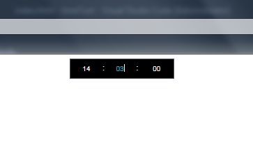

# simple-time-selector
depend on jquery 

param {string} option.containerId : used in  which element 
param {number} option.mode :  0: 00:00:00 1: 23:59:59 2: now time 
return time array (hh mm ss)

